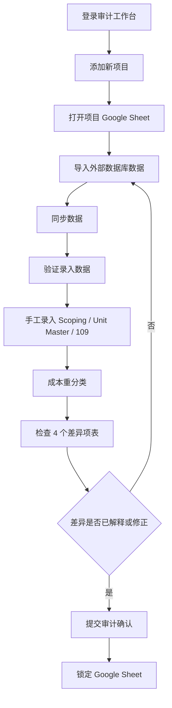

# AiWB 财务人员操作说明 v1.0

适用对象：项目财务、成本会计、审计对接人员  
适用系统：AiWB 审计工作台 + 项目 Google Sheet  
适用日期：2026-04-26  
主要入口：https://audit.frankzh.top

---

## 1. 操作目标

本说明用于指导财务人员完成单个项目从创建到审计确认锁表的完整闭环：

1. 登录审计工作台。
2. 添加新项目并生成项目 Google Sheet。
3. 在 Google Sheet 中导入或粘贴外部数据库数据。
4. 返回审计工作台执行“验证录入数据”。
5. 在 Google Sheet 中完成手工录入字段。
6. 执行“成本重分类”，并复核重分类规则和结果。
7. 使用 4 个差异项表检查数据质量。
8. 确认无误后提交审计确认，锁定 Google Sheet 表。

AiWB 的核心原则是：原始数据和最终公式保留在 Google Sheet 中，审计工作台负责读取、校验、重分类、生成快照并记录流程状态。财务人员应避免直接修改系统隐藏表和公式区域。

---

## 2. 关键概念

| 概念 | 说明 | 财务人员需要关注 |
| --- | --- | --- |
| 审计工作台 | AiWB 的网页端操作界面 | 执行同步、验证、重分类、查看差异、提交审计确认 |
| 项目 Google Sheet | 单项目的工作底稿和 109 表 | 导入外部数据、录入手工字段、查看公式结果 |
| 外部数据区 | 从 WBS、Payable、Final Detail 等来源导入的数据 | 修改后必须重新执行“验证录入数据” |
| 手工录入区 | Scoping、Unit Master、109 等人工维护区域 | 修改后必须重新执行“成本重分类” |
| 快照 | 后台保存的审计数据版本 | 用于加速看板、回溯差异、避免前端现场重算 |
| 锁定 | 提交审计确认后，项目进入只读/受控状态 | 锁定后普通人员只能查看和同步，不能继续改数 |

系统内置工作流阶段：

| 阶段 | 页面显示 | 含义 |
| --- | --- | --- |
| `project_created` | 项目报表已创建 | 项目已创建，等待导入或更新外部数据 |
| `external_data_ready` | 外部数据表已更新 | 外部数据已验证，等待手工录入或复核 |
| `manual_input_ready` | 人工录入数据已完善 | 手工录入已处理，重分类已完成或可供审计复核 |
| `locked_109_approved` | 提交审计确认 / 数据已锁定 | 审计确认已提交，Google Sheet 数据进入锁定状态 |

---

## 3. 权限和准备工作

### 3.1 登录权限

执行前确认：

- 使用本人邮箱登录，不使用共享账号。
- Gmail 用户可直接使用“Gmail 登录”。
- 非 Gmail 用户必须已登记白名单，并能接收 6 位验证码。
- 登录邮箱应与项目 Google Sheet 共享权限、项目所有者或授权人员一致。

注意事项：

- 如果页面提示未登录、Unauthorized、验证码无效或已过期，先重新登录或重新发送验证码。
- 如果能登录工作台但看不到项目，通常是项目尚未登记到当前账号或 Google Sheet 未共享给当前邮箱。
- Google Sheet 的共享权限是访问控制的一部分；不要把项目表随意共享给无关人员。

### 3.2 数据准备

导入前建议准备以下外部来源数据：

| 数据表 | 用途 | 主要要求 |
| --- | --- | --- |
| Contract | 合同基础信息 | 项目名称、合同金额、业主等信息应完整 |
| Unit Budget | 单元预算 | Unit Code、预算金额、Cost Code 等字段应完整 |
| Payable | 应付/付款明细 | Vendor、Invoice No、Amount、Incurred Date、Unit Code、Cost Code、Cost Name、Cost State 应完整 |
| Final Detail | 结算明细 | Vendor、Amount、Incurred Date、Unit Code、Cost Code、Activity/Cost Name、Cost State、Type 应完整 |
| Draw request report | 请款/提款报告 | Unit Code、Invoice、Vendor、Amount、Cost Code、Activity 等字段应完整 |
| Draw Invoice List | 请款发票清单 | 与 Draw Request report 保持一致 |
| Transfer Log | 转账记录 | 用于辅助追溯 |
| Change Order Log | 变更记录 | 用于合同变更和结算复核 |

手工录入前建议准备：

| 手工表 | 用途 | 主要要求 |
| --- | --- | --- |
| Scoping | 成本范围、GMP/Final GMP/Fee/GC/TBD 等规则识别基础 | Group、GMP 至保修月数等人工维护字段应完整；Final GMP 为空时按非 GMP 参与重分类；保修到期日、Budget amount、Incurred amount 由系统自动计算/回填，财务人员复核即可 |
| Unit Master | 单元日期链 | C/O date、TBD Acceptance Date 等需按模板要求维护；Unit Code、Final Date、实际结算日期由系统自动计算/回填，财务人员复核日期链即可 |
| 109 | 项目利润表 | 只在允许录入的单元格录入金额，不覆盖公式区域 |

禁止手工修改以下隐藏系统表：

- `AiWB_Project_State`
- `AiWB_Audit_Log`
- `AiWB_Edit_Log`
- 其他以 `AiWB_` 开头的系统工作表

---

## 4. 总体流程图

---

## 5. 步骤 1：登录审计工作台

### 5.1 操作步骤

1. 打开浏览器，访问 `https://audit.frankzh.top`。
2. 在登录页选择登录方式：
   - Gmail 用户：点击“Gmail 登录”。
   - 已登记非 Gmail 用户：输入邮箱，点击“发送验证码”。
3. 非 Gmail 用户收到验证码后，在“验证码”输入框输入 6 位验证码，点击“验证码登录”。
4. 登录成功后，页面右上角显示当前邮箱。
5. 页面进入“项目汇总”或自动打开当前可访问项目。

### 5.2 执行要求

- 必须使用本人工作邮箱。
- 登录后先确认页面右上角邮箱是否正确。
- 若同一浏览器登录过其他 Google 账号，应先退出错误账号或使用无痕窗口。

### 5.3 注意事项

- 验证码有时效，过期后需点击“重新发送”。
- 登录成功不代表已拥有所有项目权限；项目可见性仍受项目登记和 Google Sheet 共享权限控制。
- 如果页面一直停留在加载状态，先刷新页面；仍异常时记录错误提示和时间点反馈给管理员。

---

## 6. 步骤 2：添加新项目

### 6.1 操作步骤

1. 登录后在顶部导航栏点击“+”按钮，或在“项目汇总”页面点击“添加新项目”。
2. 在项目创建表单中填写：
   - `Project Short Name`：项目简称，例如 `Sandy Cove`。
   - `Project Owner`：项目负责人姓名，例如 `Taylor Chen`。
   - `Project Serial`：3 位项目编号，例如 `777`。
3. 确认信息无误后点击“创建项目”。
4. 等待系统提示“项目已创建，正在打开新表”。
5. 页面自动跳转至新项目工作台。
6. 点击“当前项目 Google Sheet”，确认新生成的项目表可以正常打开。

### 6.2 执行要求

- `Project Short Name` 不得为空，应使用公司统一项目简称。
- `Project Owner` 不得为空，建议填写实际业务负责人或项目财务负责人。
- `Project Serial` 必须是 3 位数字，并且全系统唯一。
- 创建项目后，检查项目标题中是否显示项目编号和项目名称。

### 6.3 注意事项

- 如果提示 `Project serial xxx already exists`，说明该编号已被使用，需要更换项目编号。
- 新项目由系统从 Golden Template 复制生成，不要手工复制旧项目表作为新项目底稿。
- 创建失败时不要重复快速点击；先看页面错误提示，避免产生重复项目。
- 项目创建成功后，系统会在后台登记项目和 Spreadsheet ID；不要手工修改 Spreadsheet ID。

---

## 7. 步骤 3：导入外部数据库

### 7.1 外部数据区范围

以下工作表属于外部数据区：

- `Contract`
- `Unit Budget`
- `Payable`
- `Final Detail`
- `Draw request report`
- `Draw Invoice List`
- `Transfer Log`
- `Change Order Log`

这些表的数据通常来自 WBS、付款系统、结算系统或外部导出的报表。

### 7.2 操作步骤

1. 在工作台点击“当前项目 Google Sheet”。
2. 在 Google Sheet 中切换至对应外部数据表。
3. 清理待导入数据：
   - 确保表头清晰。
   - 删除无关汇总行、空白尾行、临时备注。
   - 保留原始交易明细，不随意合并单元格。
4. 将外部数据库导出的数据粘贴到对应工作表。
5. 对关键字段做初步人工检查：
   - `Amount` 是否为数值。
   - `Incurred Date` 或相关日期是否为有效日期。
   - `Vendor` 是否完整。
   - `Unit Code`、`Cost Code`、`Cost Name` 是否完整。
   - `Cost State` 是否存在空值或明显异常。
6. 保存并关闭或返回审计工作台。

### 7.3 执行要求

- 每张外部表应保留一行明确表头。
- 不要把多个来源数据混在同一个 Sheet 中。
- 金额字段不得包含文本说明；必要时只保留金额值。
- 日期字段应使用 Google Sheet 可识别的日期格式。
- `Payable` 和 `Final Detail` 中同一交易的供应商、金额、Unit Code、Cost Code 应尽量保持一致，便于系统匹配。

### 7.4 注意事项

- 编辑外部数据区后，系统会把项目标记为外部数据已修改，并建议回到“项目报表已创建”阶段重新验证。
- 如果修改了外部数据但未执行“验证录入数据”，工作台上的看板和快照可能仍是旧版本。
- 不要在外部数据表中覆盖系统写回列，例如重分类输出列、Rule ID 输出列等。
- 对 `Final Detail` 中 `Type = Sharing` 的记录，系统规则会排除在成本重分类之外；不要为了让其参与重分类而随意改 Type。

---

## 8. 步骤 4：同步数据

### 8.1 操作步骤

1. 返回审计工作台的项目详情页。
2. 点击右侧操作区的“同步数据”。
3. 等待页面提示：
   - “同步中”
   - “后台同步中，正在刷新快照”
   - “同步完成”或“后台同步完成”
4. 查看页面的“同步时间”和“快照时间”是否更新。
5. 如果出现“快照过期”，再次点击“同步数据”或等待后台同步完成后刷新。

### 8.2 执行要求

- 每次大量导入或修改 Google Sheet 数据后，都应先点击“同步数据”。
- 同步完成后再查看差异项表，避免用旧快照判断新数据。
- 同步期间不要重复点击多个写操作按钮。

### 8.3 注意事项

- “同步数据”主要刷新前端展示和后台快照，不等同于完成验证或重分类。
- 如果项目状态加载失败，写操作会被禁用；此时应先刷新页面或联系管理员检查项目状态表。
- 如果后台同步排队中，不要马上提交审计确认。

---

## 9. 步骤 5：执行“验证录入数据”

### 9.1 适用场景

以下情形必须执行“验证录入数据”：

- 新项目首次导入外部数据后。
- 修改过 `Contract`、`Unit Budget`、`Payable`、`Final Detail`、`Draw request report` 等外部数据表后。
- 页面出现“外部数据区已修改，建议先验证录入数据”的黄色提示。
- 准备进入手工录入和重分类前。

### 9.2 操作步骤

1. 确认 Google Sheet 外部数据已导入完成。
2. 返回审计工作台项目详情页。
3. 点击“同步数据”，等待同步完成。
4. 点击“验证录入数据”。
5. 等待按钮状态从“验证中”恢复，并显示“验证录入数据已完成”。
6. 检查项目阶段是否变为“外部数据表已更新”。
7. 打开“外部数据核对”标签页，查看外部数据差异情况。

### 9.3 执行要求

- 验证前应确保外部数据表没有正在编辑或粘贴中的数据。
- 验证通过后，`external_data_dirty` 状态应被清除。
- 如果验证失败，不要继续重分类，应先排查外部数据表字段、表名和权限。

### 9.4 注意事项

- “验证录入数据”会调用后台 Worker，生成和刷新输入数据校验结果。
- 如果外部数据字段缺失或表名被改动，验证可能失败。
- 验证完成不代表数据无差异，只代表系统已完成读取和生成；仍需检查差异项表。

---

## 10. 步骤 6：手工录入字段

### 10.1 手工录入区范围

以下工作表属于手工录入区：

- `Scoping`
- `Unit Master`
- `109`

编辑这些表后，系统会把项目标记为人工录入区已修改，并提示重新执行成本重分类。

### 10.2 Scoping 录入要求

`Scoping` 是重分类规则的核心基础。重点检查：

| 字段 | 要求 |
| --- | --- |
| Group | 每个成本组应有明确编号或名称 |
| Scoping 标识列 | GMP 用于预算口径；Final GMP、Fee、GC、WTC、TBD 等用于重分类口径；Final GMP 为空时按非 GMP 处理 |
| 保修月数 | 用于计算保修窗口，应为可识别数值 |
| 保修到期日 | 系统根据保修月数及相关日期自动计算/回填，财务人员只需复核结果是否符合实际业务逻辑 |
| Budget amount | 系统根据 Unit Budget 或项目预算数据自动计算/回填，财务人员只需复核是否与审批底稿一致 |
| Incurred amount | 系统根据外部成本数据自动计算/回填，财务人员只需复核是否与成本明细一致 |

注意事项：

- 保修到期日、Budget amount、Incurred amount 不是手工录入项；如结果异常，应优先检查保修月数、Unit Budget、Payable、Final Detail 等来源数据。
- 如果某行已有系统计算结果，但 E-J 列、保修月数等人工维护字段为空，工作台会在“手工录入核对 / Scoping”中显示“未录入数值”。
- 不要随意删除 Scoping 中的 Group 行；这会影响 109 公式映射和成本重分类判断。
- 如果不确定某个成本组应归属哪类标识，应先与项目财务负责人或审计负责人确认。

### 10.3 Unit Master 录入要求

`Unit Master` 管理单元级日期链。重点字段：

| 字段 | 要求 |
| --- | --- |
| Unit Code | 系统根据项目单元数据自动计算/回填，财务人员只需复核是否与 Payable、Final Detail、Unit Budget 中的 Unit Code 对齐 |
| C/O date | 单元 C/O 日期 |
| Final Date | 系统自动计算/回填，财务人员只需复核是否不早于 C/O date |
| 实际结算日期 | 系统自动计算/回填，财务人员只需复核是否不早于 Final Date |
| TBD Acceptance Date | 不应早于实际结算日期 |

注意事项：

- Unit Code、Final Date、实际结算日期不是手工录入项；如结果异常，应优先检查外部来源数据、单元状态、结算资料和系统计算依据。
- 日期顺序异常会在“手工录入核对 / Unit Master 日期链”中以红色显示。
- 日期可以使用 Google Sheet 可识别格式，例如 `MM/DD/YYYY` 或 `YYYY-MM-DD`。
- 结算日期直接影响 RACC、ACC、TBD、EXP 等规则判断，复核时应与结算资料核对。

### 10.4 109 表录入要求

`109` 是项目利润表和审计公式表。重点要求：

- 只在允许手工录入的单元格输入金额。
- 不要覆盖公式区域。
- 不要插入或删除会改变模板结构的行列。
- 不要修改年度轴、表头、关键字段名称。
- 录入后返回工作台查看“项目利润表录入金额”和“错误数据”。

工作台当前会重点校验以下逻辑：

| 校验项 | 异常说明 |
| --- | --- |
| POC 累积完工比例 vs 当期完工比例 | 两者不一致时显示错误 |
| POC 是否大于 100% | 超过 100% 时显示错误 |
| POC = 100% 时合同变动金额 vs 当期计算收入 | 不一致时显示错误 |
| ROE 成本 WB Home vs WB Home 收入 | ROE 成本应等于 WB Home 收入的相反数 |

### 10.5 手工录入后的动作

手工录入完成后：

1. 回到审计工作台。
2. 点击“同步数据”。
3. 检查“手工录入核对”标签页。
4. 如果没有错误数据，再执行“成本重分类”。

---

## 11. 步骤 7：执行“成本重分类”

### 11.1 执行前检查

执行前必须确认：

- 外部数据已导入并执行过“验证录入数据”。
- `Scoping`、`Unit Master`、`109` 已完成手工录入或系统自动计算字段复核。
- “手工录入核对”中没有未解释的错误数据。
- 页面没有“快照过期”提示。
- 当前项目未被锁定。

### 11.2 操作步骤

1. 在项目详情页点击“成本重分类”。
2. 等待页面提示“正在提交重分类”。
3. 系统完成后会提示“成本重分类已完成”或后台返回的执行信息。
4. 页面自动切换到“成本重分类”标签页。
5. 查看重分类前后 Cost State、内部公司重分类对比、规则明细和变更条数。
6. 如需查看规则说明，点击顶部“重分类规则”按钮。

### 11.3 重分类规则摘要

系统当前规则库包括以下类别：

| Rule ID | 类别 | 主要含义 |
| --- | --- | --- |
| R000 | Excluded | Final Detail 中 Type 为 Sharing 的记录排除 |
| R101 | GC | Unit Code 包含 General Condition 关键字 |
| R102 | Consulting | 结算前 WTC 且供应商为 WB Texas Consulting LLC |
| R103 | GC2 | 结算前 WTC 且供应商为非关联咨询商 |
| R104 | GC Income | 结算前 Final GMP + GC 且供应商为 Wan Pacific |
| R105 | GC | 结算前 Final GMP + GC 且供应商非 Wan Pacific |
| R106 | Income | 结算前 Final GMP + Fee 且供应商为 Wan Pacific |
| R107 | ROE | 结算前标准 Final GMP/Fee ROE 特征 |
| R108 | Direct | 结算前未命中 Scoping 标识的兜底成本 |
| R201 | ACC | 结算后仅有 Final Date 且无 Incurred Date |
| R202 | RACC | 结算后命中跨表或成对 RACC 配对键 |
| R203 | TBD | 有效日期晚于 TBD Acceptance Date 且 Scoping J 列 = 6 |
| R204 | RACC2 | 发生日不晚于保修到期日且符合 Final GMP/Fee ROE 特征 |
| R205 | EXP | 结算后支出兜底 |
| R301 | RACC | Payable 端结算前后窗口修正 |
| R302 | ACC | Final Detail 端结算前后窗口修正 |

### 11.4 执行要求

- 成本重分类 1 小时内仅允许执行一次。
- 不要在重分类执行中编辑 Google Sheet。
- 重分类完成后应立即检查变更条数和金额流向。
- 如果手工录入区修改过，必须重新执行重分类。

### 11.5 注意事项

- 重分类会写回 `Payable` 和 `Final Detail` 的分类/规则结果列。
- 重分类只代表系统按规则给出结果，不代表财务已经完成审计判断。
- 如出现规则结果与业务判断不一致，应先检查 Scoping、Unit Master、Vendor、Unit Code、Cost Code、日期字段，再决定是否需要调整源数据或规则。
- 不要通过手工覆盖重分类输出列来“修正”结果，应修正输入数据或规则依据。

---

## 12. 步骤 8：检查数据质量：4 个差异项表

工作台有 4 个核心质量检查标签页。提交审计确认前，必须逐一检查。

### 12.1 差异项表 1：外部数据核对

入口：项目详情页 -> “外部数据核对”

重点检查：

| 检查区域 | 检查内容 | 处理要求 |
| --- | --- | --- |
| Unit/Common 个数 | 各来源表 Unit 和 Common 数量是否合理 | 数量异常时回查源表是否漏导或重复导入 |
| Payable 内部公司矩阵 | 内部公司在各 Cost State 的金额分布 | 内部交易金额异常时回查 Vendor 和 Cost State |
| Cost State 金额矩阵 | Payable、Final Detail、Draw Request report 三表金额是否按 Cost State 对齐 | 对差异条数逐项点击明细，确认是否为时点差异或数据错误 |
| Cost State 汇总合计 vs 原始 Amount 合计 | 分组金额合计是否等于原始金额合计 | 若原始合计标红，需检查空 Cost State、金额格式、漏行 |

必须重点处理的异常：

- 差异条数大于 0 且无法解释。
- 某 Cost State 在 Payable 有金额但 Final Detail 或 Draw Request 缺失。
- 原始 Amount 合计与 Cost State 汇总合计不一致。
- 内部公司金额落入明显错误的 Cost State。

### 12.2 差异项表 2：手工录入核对

入口：项目详情页 -> “手工录入核对”

重点检查：

| 检查区域 | 检查内容 | 处理要求 |
| --- | --- | --- |
| 项目利润表录入金额 | 109 表中被识别为手工录入的金额 | 核对金额是否来自审批底稿或财务确认文件 |
| 错误数据 | POC、收入、ROE 等逻辑校验异常 | 错误必须修正或形成书面解释后才能继续 |
| Scoping | Group、E-J 列、保修月数等人工维护信息，以及系统自动计算的保修到期日、预算和已发生成本 | 状态为“未录入数值”的行应补齐人工维护字段；自动计算结果异常时回查来源数据 |
| Unit Master 日期链 | C/O date、TBD Acceptance Date，以及系统自动计算的 Unit Code、Final Date、实际结算日期 | 红色日期异常必须回查来源数据、计算依据并修正 |

必须重点处理的异常：

- “错误数据”表中存在任何未解释项目。
- Scoping 行存在预算或已发生金额，但规则字段为空。
- 系统自动计算的 Final Date 早于 C/O date。
- 系统自动计算的实际结算日期早于 Final Date。
- TBD Acceptance Date 早于实际结算日期。

### 12.3 差异项表 3：成本重分类

入口：项目详情页 -> “成本重分类”

重点检查：

| 检查区域 | 检查内容 | 处理要求 |
| --- | --- | --- |
| Payable 表内重分类对比 | Payable 重分类前后 Cost State、金额和条数 | 关注大额变更、异常流向、未分配 |
| Final Detail 表内重分类对比 | Final Detail 重分类前后 Cost State、金额和条数 | 与 Payable 结果交叉核对 |
| 重分类前 Cost State | 原始 Cost State 金额结构 | 判断源数据是否存在明显错分 |
| 重分类后 Cost State | 系统分类后的金额结构 | 判断是否符合项目会计口径 |
| 内部公司重分类对比 | 内部公司交易的重分类流向 | 特别关注 Wan Pacific、WB Texas Consulting LLC 等关联方 |
| 规则明细 | Rule ID、Category、金额、发票数 | 复核规则命中是否符合业务事实 |

必须重点处理的异常：

- 大额金额从 Direct 变更到 Income、ROE、ACC、RACC、EXP 等类别但缺少依据。
- `未分配` 金额仍然较大。
- 内部公司供应商分类不符合合同或结算约定。
- RACC、ACC、TBD、EXP 与 Unit Master 日期链不一致。
- 同一供应商、同一 Unit Code、同一 Cost Code 在 Payable 和 Final Detail 结果不一致。

### 12.4 差异项表 4：项目利润表对比

入口：项目详情页 -> “项目利润表对比”

重点检查：

| 检查区域 | 检查内容 | 处理要求 |
| --- | --- | --- |
| 指标数 | 被识别的 109 指标数量 | 指标过少可能是 109 模板结构被改动 |
| 总差异 | 公司列与审计列的绝对差异合计 | 提交前应为 0 或已形成明确解释 |
| Mapping Score | 字段映射健康度 | 分数异常低时检查 109 表头和字段名称 |
| Fallback Count | 回退映射数量 | 回退数量大于 0 时需检查字段映射是否被破坏 |
| Revenue / Actual Cost / Gross Margin / POC | 年度公司值、审计值、差异 | 逐年复核差异 |

必须重点处理的异常：

- 总差异非 0 且无解释。
- 出现 `MAPPING_AMBIGUITY` 或 `MAPPING_FALLBACK` 警告。
- Mapping Score 明显低于预期。
- Fallback Count 大于 0。
- 收入、成本、毛利、POC 的公司列与审计列不一致。

### 12.5 数据质量检查结论

提交审计确认前，建议财务人员形成以下结论：

| 检查项 | 通过标准 |
| --- | --- |
| 外部数据核对 | 三表金额、Unit/Common、Cost State 合计无未解释差异 |
| 手工录入核对 | 无错误数据，Scoping 和 Unit Master 无未解释异常 |
| 成本重分类 | 重分类流向、Rule ID、内部公司金额均已复核 |

如果任一项未通过，应返回对应数据表修正，并重新执行：

- 外部数据有修改：同步数据 -> 验证录入数据 -> 手工检查 -> 成本重分类。
- 手工录入有修改：同步数据 -> 手工检查 -> 成本重分类。
- 重分类规则依据有问题：修正 Scoping/Unit Master/源数据 -> 成本重分类。

---

## 13. 步骤 9：提交审计确认并锁定 Google Sheet

### 13.1 提交前最终检查

点击“提交审计确认”前，必须确认：

- 页面没有黄色的外部数据或人工录入修改提示。
- 页面没有“快照过期”提示。
- 最近一次“同步数据”已完成。
- 最近一次“验证录入数据”已完成。
- 最近一次“成本重分类”已完成。
- 4 个差异项表均已检查并通过。
- 109 表中的收入、成本、毛利、POC 等核心指标已与项目财务负责人确认。
- 项目 Google Sheet 中不存在正在编辑的未保存更改。

### 13.2 操作步骤

1. 在审计工作台项目详情页点击“提交审计确认”。
2. 等待按钮显示“提交中”并完成。
3. 页面提示“提交审计确认已记录”。
4. 项目阶段变为“提交审计确认 / 数据已锁定”。
5. 页面显示“数据已锁定”。
6. 点击“物理锁定区域”按钮，检查 109 主表公式锁定区域是否存在。
7. 打开 Google Sheet，确认关键公式区域已受保护。
8. 点击“项目日志”，确认有 `approve_109` 成功记录。

### 13.3 锁定后的状态

锁定后：

- 项目进入审计确认状态。
- Google Sheet 文件名可能按项目编号、项目名称和日期规范化。
- 普通人员只能执行“当前项目 Google Sheet”和“同步数据”等查看型操作。
- 项目所有者或管理员可看到“解除锁定数据”。

### 13.4 注意事项

- 如果系统提示“项目数据已变更，请先完成同步和重分类后再审批”，说明外部数据或手工录入区仍有未处理修改，不允许提交。
- 提交审计确认是强控制动作，不应在差异未解释时使用。
- 锁定后如需修改数据，应由项目所有者或管理员执行“解除锁定数据”，修改后重新走验证、重分类和审计确认流程。
- 不要通过复制文件、另存为或手工删除保护区域来绕过锁定。

---

## 14. 解锁与返工流程

### 14.1 适用场景

以下情况可能需要解除锁定：

- 审计师提出新的调整意见。
- 项目财务发现提交后数据错误。
- 外部系统补发或更正源数据。
- 109 表手工录入需要更正。

### 14.2 操作步骤

1. 由项目所有者或管理员登录审计工作台。
2. 打开已锁定项目。
3. 点击“解除锁定数据”。
4. 页面提示“项目已解除锁定”。
5. 在 Google Sheet 中完成必要修改。
6. 根据修改区域重新执行流程：
   - 外部数据修改：同步数据 -> 验证录入数据 -> 成本重分类 -> 4 表检查 -> 提交审计确认。
   - 手工录入修改：同步数据 -> 成本重分类 -> 4 表检查 -> 提交审计确认。

### 14.3 注意事项

- 只有项目所有者或管理员可解锁。
- 解锁和重新提交都会写入项目日志。
- 解锁后原锁定结论不再作为最终版本，应以重新提交后的版本为准。

---

## 15. 常见异常和处理

| 异常 | 可能原因 | 处理方式 |
| --- | --- | --- |
| 登录后无项目 | 当前邮箱未登记项目或 Google Sheet 未共享 | 联系管理员确认项目登记和共享权限 |
| 创建项目失败 | 项目编号重复、模板配置异常、后台 Worker 异常 | 更换编号或联系管理员 |
| 同步失败 | Google Sheet 权限、表名变更、后台连接异常 | 检查表是否可打开，保留错误提示反馈 |
| 验证录入数据失败 | 外部数据表缺失、表头异常、后台 Worker 失败 | 检查表名和关键字段后重试 |
| 成本重分类失败 | 必要表缺失、规则输入异常、后台重分类服务异常 | 检查 Payable、Final Detail、Scoping、Unit Budget、Unit Master |
| 成本重分类按钮不可点 | 项目忙、1 小时冷却中、项目状态加载失败 | 等待冷却结束或刷新页面 |
| 快照过期 | Google Sheet 源文件晚于当前快照 | 点击同步数据并等待后台完成 |
| 数据已锁定仍需修改 | 项目已经提交审计确认 | 由项目所有者解除锁定后返工 |
| 109 对比出现 Mapping 警告 | 109 模板字段、表头或年度轴被修改 | 恢复模板结构或联系管理员修复映射 |

---

## 16. 财务人员提交前检查清单

提交审计确认前，请逐项确认：

- [ ] 使用本人授权邮箱登录。
- [ ] 项目名称、项目编号、项目负责人正确。
- [ ] 外部数据表已完整导入。
- [ ] 已执行“同步数据”。
- [ ] 已执行“验证录入数据”。
- [ ] `Scoping` 人工维护字段已完整录入，未解释的“未录入数值”为 0，系统自动计算字段已复核。
- [ ] `Unit Master` 日期链无未解释红色异常，Unit Code、Final Date、实际结算日期等自动计算字段已复核。
- [ ] `109` 手工录入金额已与底稿一致。
- [ ] 已执行“成本重分类”，且不在冷却/失败状态。
- [ ] 外部数据核对无未解释差异。
- [ ] 手工录入核对无未解释错误。
- [ ] 成本重分类结果和 Rule ID 已复核。
- [ ] 页面无“快照过期”提示。
- [ ] 页面无“外部数据区/人工录入区已修改”提示。
- [ ] 项目负责人或审计对接人已确认可提交。
- [ ] 已点击“提交审计确认”并看到“数据已锁定”。
- [ ] 已检查“物理锁定区域”和“项目日志”。

---

## 17. 操作纪律

1. 不直接修改隐藏系统表。
2. 不覆盖 109 公式区域。
3. 不为了消除差异而删除原始交易行。
4. 不手工覆盖系统重分类输出列。
5. 不在重分类、同步、验证执行中继续编辑 Google Sheet。
6. 不在未完成 4 个差异项表复核前提交审计确认。
7. 不绕过系统锁定或复制文件作为最终审计版本。
8. 所有返工必须重新走同步、验证、重分类、复核、提交流程。

---

## 18. 推荐归档资料

每次提交审计确认后，建议留存：

- 项目 Google Sheet 链接。
- 提交审计确认时间和提交人。
- 项目日志截图或导出记录。
- 4 个差异项表的复核结论。
- 对未消除但已解释差异的说明。
- 审计师或项目负责人的确认记录。

---

## 19. 版本记录

| 版本 | 日期 | 说明 |
| --- | --- | --- |
| v1.0 | 2026-04-26 | 初版，覆盖登录、创建项目、导入外部数据、验证录入、手工录入、成本重分类、4 个差异项表复核、提交审计确认和锁表流程 |
